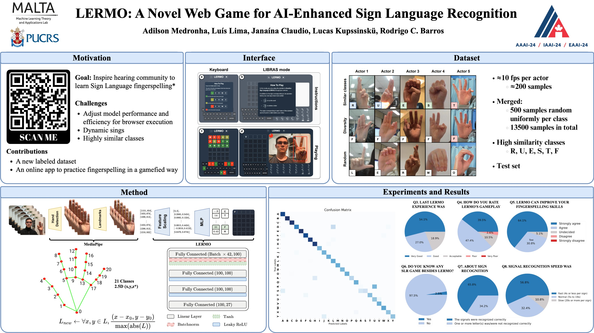

# LERMO 
(https://lermo.app/) is a web game that merges machine learning and gamification for practicing sign language fingerspelling. Our paper can be found in the AAAI-24 proceedings [coming soon]. 

[ Adilson](https://www.linkedin.com/in/adilsonmedronha/)
[ Luis](https://github.com/Lu1sLima)