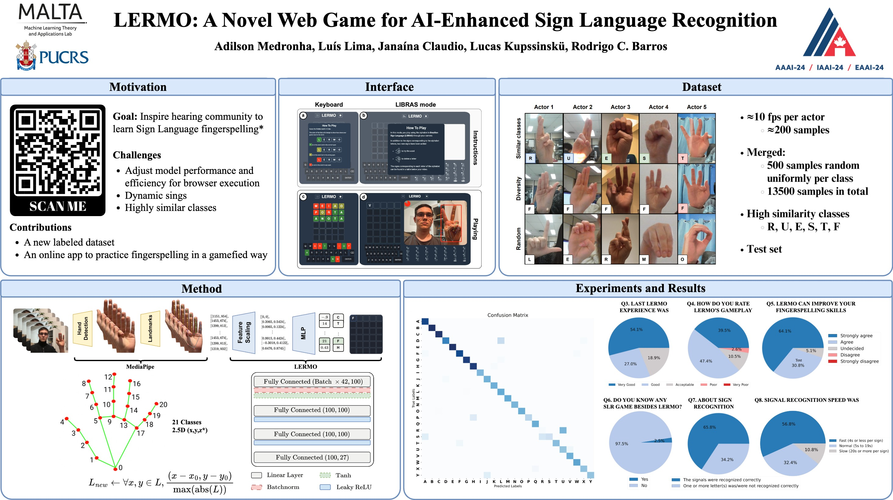

# LERMO 
(https://lermo.app/) is a web game that merges machine learning and gamification for practicing sign language fingerspelling. Our paper can be found in the AAAI-24 proceedings [coming soon]. 

  <a href="https://www.linkedin.com/in/adilsonmedronha/">
    
    Adilson Medronha
  </a>
  - adilson.medronha@edu.pucrs.br

  <a href="https://github.com/lu1slima">
    
    Luís Lima
  </a>
  - luis.contato01@gmail.com

